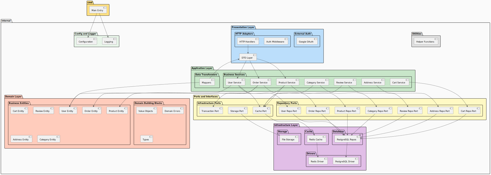
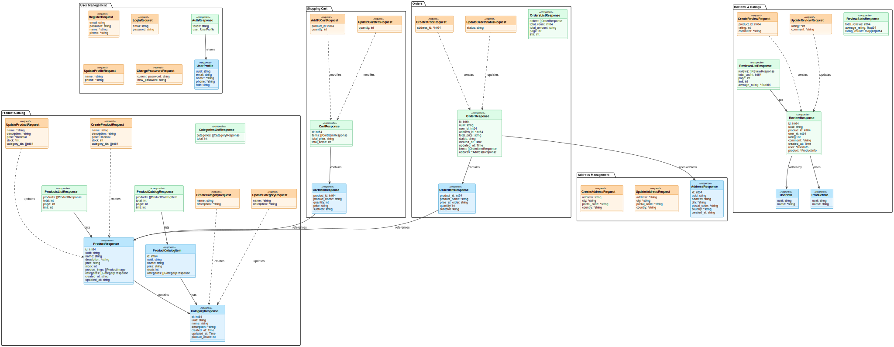

# GoShop - E-Commerce Platform

Современная, масштабируемая платформа электронной коммерции, построенная с использованием принципов **Clean Architecture** и **Hexagonal Architecture**. Написана на Go с акцентом на поддерживаемость, тестируемость и производительность.

## Описание проекта

GoShop - это полнофункциональный REST API для электронной коммерции, демонстрирующий профессиональные практики разработки на Go, включая:

- **Clean Architecture** с четким разделением ответственности
- **Hexagonal Architecture** (Ports & Adapters) для внедрения зависимостей
- Принципы **Domain-Driven Design**
- Профессиональную обработку ошибок и логирование
- OAuth 2.0 аутентификацию (Google)
- Кэширование с Redis
- Хранилище файлов S3
- Миграции БД PostgreSQL

## Архитектура

Проект следует **многоуровневой архитектуре** с четкими границами между слоями:

```text
┌─────────────────────────────────────────────┐
│           Presentation Layer                │
│   (HTTP Handlers, Middleware, DTO, Mappers) │
└────────────┬────────────────────────────────┘
             │
┌────────────▼────────────────────────────────┐
│          Application Layer                  │
│        (Services, Use Cases)                │
└────────────┬────────────────────────────────┘
             │
┌────────────▼────────────────────────────────┐
│            Domain Layer                     │
│    (Entities, Value Objects, Rules)         │
└────────────┬────────────────────────────────┘
             │
┌────────────▼────────────────────────────────┐
│         Ports & Interfaces                  │
│   (Repository, Cache, Storage Contracts)    │
└────────────┬────────────────────────────────┘
             │
┌────────────▼────────────────────────────────┐
│        Infrastructure Layer                 │
│  (Database, Cache, Storage Implementations) │
└─────────────────────────────────────────────┘
```

### Диаграмма архитектуры



### Диаграмма моделей данных



## Структура проекта

```text
goshop/
├── cmd/
│   └── goshop/              # Application entry point
│       └── main.go
├── pkg/                     # Reusable packages
│   ├── jwt/                 # JWT token generation & parsing
│   ├── crypto/              # Password hashing & random generation
│   └── logger/              # Logger configuration
├── internal/
│   ├── adapters/            # External interfaces (HTTP, Database, Cache)
│   │   ├── input/http/      # HTTP handlers & routes
│   │   ├── mappers/         # DTO <-> Domain entity mappers
│   │   └── output/          # Database, cache, storage adapters
│   ├── config/              # Configuration management
│   ├── core/
│   │   ├── domain/          # Business entities & rules
│   │   │   ├── entities/
│   │   │   ├── vo/          # Value objects
│   │   │   ├── types/
│   │   │   └── errors/
│   │   ├── ports/           # Interface contracts
│   │   │   ├── repositories/
│   │   │   ├── services/
│   │   │   ├── cache/
│   │   │   └── transaction/
│   │   └── services/        # Application services (use cases)
│   ├── infrastructure/      # Low-level implementations
│   │   ├── database/
│   │   └── transaction/
│   ├── middleware/          # HTTP middleware
│   ├── oauth/               # OAuth integrations
│   ├── dto/                 # Data Transfer Objects
│   └── validation/          # Input validation
├── docs/
│   ├── diagrams/            # Architecture & data model diagrams
│   ├── swagger/             # Swagger/OpenAPI generated files
│   ├── ARCHITECTURE.md
│   └── SETUP.md
├── migrations/              # Database migrations
├── Makefile
├── README.md
└── go.mod
```

## Быстрый старт

### Требования

- Go 1.21+
- PostgreSQL 14+
- Redis 7+
- S3-совместимое хранилище (MinIO или AWS S3)
- Docker и Docker Compose (опционально)

### Установка

1. **Клонируйте репозиторий**

   ```bash
   git clone <repository-url>
   cd goshop
   ```

2. **Установите зависимости**

   ```bash
   go mod download
   ```

3. **Настройте переменные окружения**

   ```bash
   cp .env.example .env
   # Отредактируйте .env с вашей конфигурацией
   ```

4. **Запустите миграции БД**

   ```bash
   make migrate-up
   ```

5. **Запустите сервер**

   ```bash
   make run
   ```

API будет доступен по адресу `http://localhost:8080`

## Документация API

### Swagger/OpenAPI

Документация API генерируется автоматически с помощью Swagger:

- **Swagger UI**: [http://localhost:8080/swagger/index.html](http://localhost:8080/swagger/index.html)
- **OpenAPI JSON**: [http://localhost:8080/swagger/doc.json](http://localhost:8080/swagger/doc.json)

### Основные endpoints

#### Аутентификация

- `POST /auth/register` - Регистрация нового пользователя
- `POST /auth/login` - Вход с email и пароль
- `GET /auth/google/login` - Перенаправление на Google OAuth
- `GET /auth/google/callback` - Обработка ответа от Google OAuth

#### Пользователи (требует авторизации)

- `GET /api/v1/profile` - Получить профиль текущего пользователя
- `PUT /api/v1/profile` - Обновить профиль
- `PUT /api/v1/profile/avatar` - Загрузить аватар
- `GET /api/v1/avatar` - Получить аватар

#### Товары

- `GET /products` - Список товаров (с пагинацией)
- `GET /products/:id` - Получить детали товара
- `GET /products/category/:id` - Товары по категории
- `POST /admin/products` - Создать товар (админ)
- `PUT /admin/products/:id` - Обновить товар (админ)
- `DELETE /admin/products/:id` - Удалить товар (админ)
- `PATCH /admin/products/:id/toggle` - Включить/выключить товар (админ)
- `POST /admin/products/:id/images` - Добавить фото товара (админ)
- `DELETE /admin/products/:id/images/:img_id` - Удалить фото товара (админ)

#### Категории

- `GET /categories` - Список всех категорий
- `GET /categories/:id` - Детали категории
- `POST /admin/categories` - Создать категорию (админ)
- `PUT /admin/categories/:id` - Обновить категорию (админ)
- `DELETE /admin/categories/:id` - Удалить категорию (админ)

#### Корзина (требует авторизации)

- `GET /api/v1/cart` - Получить корзину пользователя
- `POST /api/v1/cart/items` - Добавить товар в корзину
- `PUT /api/v1/cart/items/:product_id` - Обновить количество товара
- `DELETE /api/v1/cart/items/:product_id` - Удалить товар из корзины
- `DELETE /api/v1/cart` - Очистить корзину

#### Заказы (требует авторизации)

- `POST /api/v1/orders` - Создать новый заказ
- `GET /api/v1/orders` - Список заказов пользователя
- `GET /api/v1/orders/:id` - Детали заказа
- `POST /api/v1/orders/:id/cancel` - Отменить заказ
- `PUT /admin/orders/:id/status` - Обновить статус заказа (админ)
- `GET /admin/orders` - Список всех заказов (админ)

#### Отзывы

- `GET /reviews` - Список отзывов
- `GET /reviews/:id` - Детали отзыва
- `GET /reviews/stats/:productId` - Статистика отзывов товара
- `POST /api/v1/reviews` - Создать отзыв (требует авторизации)
- `PUT /api/v1/reviews/:id` - Обновить отзыв (требует авторизации)
- `DELETE /api/v1/reviews/:id` - Удалить отзыв (требует авторизации)

#### Адреса (требует авторизации)

- `POST /api/v1/addresses` - Создать адрес
- `GET /api/v1/addresses` - Список адресов
- `GET /api/v1/addresses/:id` - Детали адреса
- `PUT /api/v1/addresses/:id` - Обновить адрес
- `DELETE /api/v1/addresses/:id` - Удалить адрес

## Разработка

### Доступные команды

```bash
# Запустить приложение
make run

# Запустить тесты
make test

# Сгенерировать покрытие тестами
make coverage

# Миграции БД
make migrate-up
make migrate-down
make migrate-fresh

# База данных
make db-create
make db-drop

# Разработка
make fmt          # Форматирование кода
make lint         # Линтер
make vet          # go vet
```

### Тестирование

```bash
# Запустить все тесты
go test ./...

# Тесты с покрытием
go test -cover ./...

# Конкретный тест
go test -run TestName ./path/to/package
```

## Основные возможности

### Аутентификация и авторизация

- JWT-токены аутентификация
- OAuth 2.0 интеграция (Google)
- Контроль доступа по ролям (Пользователь, Админ)

### Функции электронной коммерции

- Каталог товаров с категориями
- Управление корзиной покупок
- Обработка заказов
- Система отзывов и рейтинга
- Управление адресами

### Технические возможности

- **Кэширование**: Redis для производительности
- **Хранилище файлов**: S3-совместимое хранилище для фото товаров
- **База данных**: PostgreSQL с миграциями
- **Логирование**: Структурированное логирование с Zap
- **Обработка ошибок**: Пользовательские ошибки домена с правильными HTTP кодами
- **Валидация**: Валидация запросов с binding тегами

## Stack технологий

- **Язык**: Go 1.21+
- **Framework**: Gin Web Framework
- **БД**: PostgreSQL 14+
- **Кэш**: Redis 7+
- **ORM**: Без ORM (raw SQL с pgx для type safety)
- **Хранилище**: S3-совместимое хранилище
- **Логирование**: Uber's Zap
- **Аутентификация**: JWT, Google OAuth 2.0
- **API Docs**: Swagger/OpenAPI 3.0
- **Тестирование**: Go built-in testing + Testify

## Результаты обучения

Этот проект демонстрирует:

1. **Принципы Clean Architecture**
   - Разделение ответственности
   - Инверсия зависимостей
   - Дизайн на основе интерфейсов

2. **Best Practices на Go**
   - Паттерны обработки ошибок
   - Использование Context
   - Паттерны конкурентности
   - Организация пакетов

3. **Domain-Driven Design**
   - Моделирование сущностей
   - Value objects
   - Domain events
   - Bounded contexts

4. **Enterprise Паттерны**
   - Repository паттерн
   - Mapper паттерн
   - Service layer паттерн
   - Unit of Work паттерн

## Статус разработки

- Готово: Аутентификация и авторизация
- Готово: Управление пользователями
- Готово: Каталог товаров
- Готово: Корзина покупок
- Готово: Управление заказами
- Готово: Система отзывов
- Готово: Стратегия кэширования
- Готово: S3 интеграция
- В разработке: Обработка платежей
- В разработке: Система уведомлений
- В разработке: Аналитика

## Автор

Создано как портфолио-проект для поступления на стажировку.

---

Для подробной документации архитектуры см. [ARCHITECTURE.md](./docs/ARCHITECTURE.md)

Для инструкций по установке см. [SETUP.md](./docs/SETUP.md)
